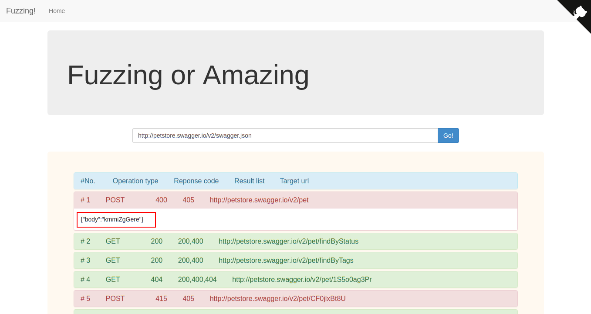

# fuzzing-api


## Installation

```bash
git clone https://github.com/qfdk/fuzzing-api
cd fuzzing-api/fuzzing
mvn install && jetty:run
```

You should see the web ui via your browser in this address **http://localhost:8080**.



default `swagger.json` : http://localhost:8080/swagger.json


## REST api/v1

- /getPath?url=
- /analyse
- todo

## todo list

[X] web ui
[ ] call back
[ ] backend singleton

